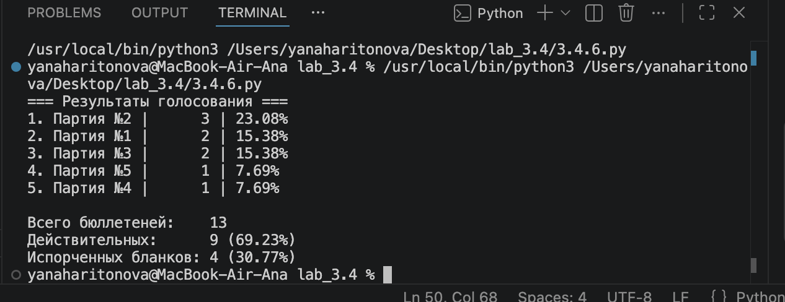
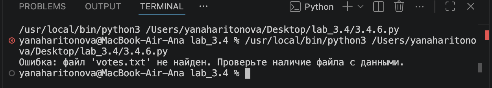

# Лабораторная работа — Подсчёт голосов (3.4.6)

## Описание программы

Программа читает файл `votes.txt`, содержащий номера партий (от 1 до 5), и подсчитывает результаты голосования. Все некорректные данные (нечисловые токены, число `-1`, числа вне диапазона 1–5) считаются испорченными бюллетенями. В конце выводится рейтинг партий и статистика по действительным и недействительным голосам.

### Обрабатываемые исключения

| Ситуация | Тип исключения | Обработка |
|---|---|---|
| Токен не является числом (напр. `abc`) | `ValueError` | Бюллетень считается испорченным |
| Значение равно `-1` | Логическая проверка | Бюллетень считается испорченным |
| Число вне диапазона 1–5 (напр. `10`, `14`) | Логическая проверка | Бюллетень считается испорченным |
| Файл `votes.txt` не найден | `FileNotFoundError` | Выводится сообщение об ошибке, программа завершается |

---

## Запуск программы

### ✅ Корректный запуск

**Что нужно:** файл `votes.txt` должен лежать в той же папке, что и скрипт.

**Команда в терминале:**
```
python 3_4_6.py
```

**Содержимое `votes.txt`:**
```
1 3 14 10 2 3 -1 2 2 1 5 abc 4
```

**Что происходит:**
- Программа открывает файл и читает все токены
- Корректные голоса (1–5): `1, 3, 2, 3, 2, 2, 1, 5, 4` → 9 действительных
- Испорченные: `14` (вне диапазона), `10` (вне диапазона), `-1` (маркер порчи), `abc` (не число) → 4 недействительных
- Выводится рейтинг партий и итоговая статистика

**Скрин корректного выполнения:**



---

### ❌ Запуск с ошибкой (файл не найден)

**Что нужно:** удалить или переименовать файл `votes.txt`, чтобы его не было в папке.

**Команды в терминале:**
```
del votes.txt
python 3_4_6.py
```

**Что происходит:**
- Программа пытается открыть `votes.txt`
- Файл не найден → возникает исключение `FileNotFoundError`
- Исключение перехватывается блоком `except FileNotFoundError`
- Выводится понятное сообщение об ошибке без системного трейсбека
- Программа завершается с кодом выхода `1`

**Почему не падает с трейсбеком:** исключение обработано вручную — программа сама сообщает о проблеме и корректно завершается.

**Скрин запуска с ошибкой:**



---

## Структура файлов

```
├── 3_4_6.py      — основной скрипт
├── votes.txt     — файл с голосами
└── README.md     — данное описание
```
